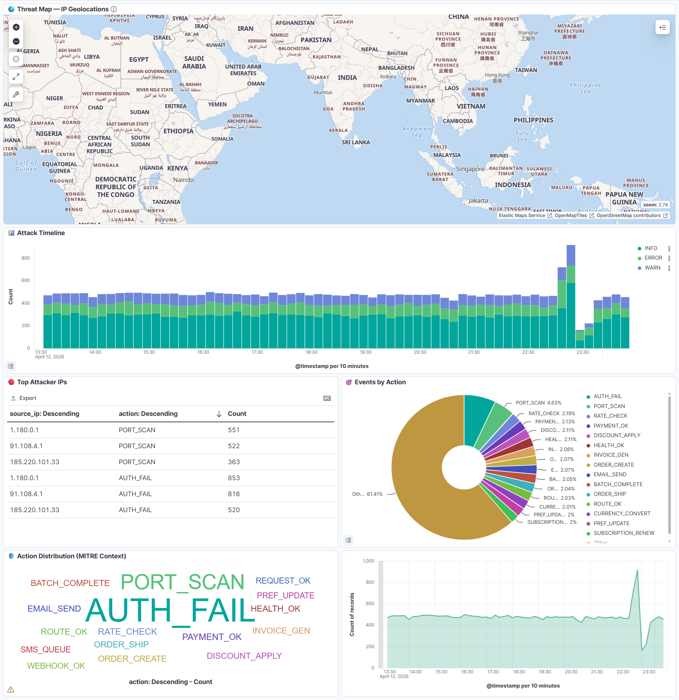
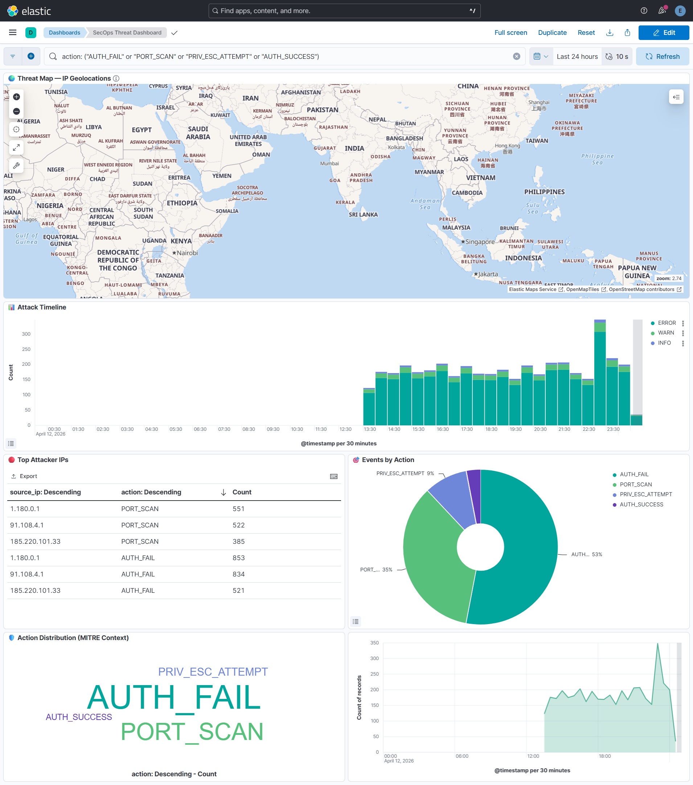
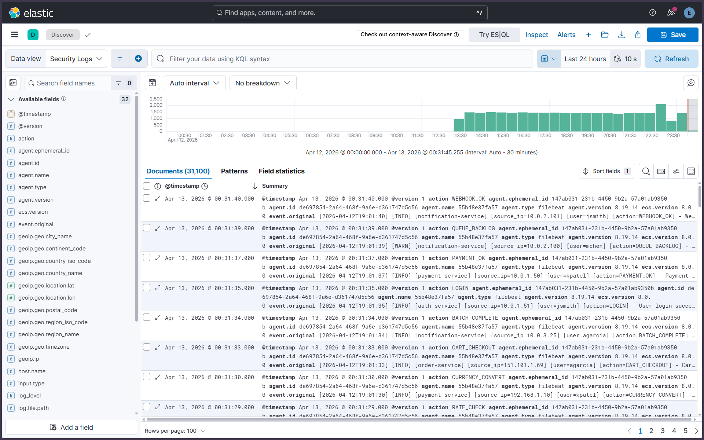

# ELK Stack SecOps: Dockerized Security Monitoring Pipeline


A production-inspired **Elasticsearch, Logstash, Kibana (ELK)** stack with automated log generation, **SIEM detection rules**, and **ML anomaly detection**, orchestrated with Docker Compose.



---

## What This Demonstrates

- Designed and wired a full log ingestion pipeline from scratch: Python generator → Filebeat → Logstash → Elasticsearch → Kibana
- Wrote four SIEM detection rules mapped to MITRE ATT&CK techniques, including an **EQL sequence rule** that correlates brute force attempts with successful logins from the same IP — a pattern threshold rules alone cannot catch
- Configured Elastic ML anomaly detection with per-IP statistical baselining to surface attack bursts that don't match known signatures
- Chose a **dual-index architecture** (`app-logs-*` and `security-logs-*`) to separate operational telemetry from security events, enabling independent ILM policies and tighter detection rule scoping
- Used **ElastAlert2 alongside native SIEM rules** because native rules require an active Kibana session to evaluate — ElastAlert2 provides persistent, daemon-based alerting that survives restarts
- Validated the full pipeline against 30,000+ ingested security events during load testing

---

## Stack

| Component | Role |
|---|---|
| **Elasticsearch** | Storage and full-text search |
| **Logstash** | Log parsing and GeoIP enrichment |
| **Kibana** | Dashboards, SIEM Detection Engine, ML |
| **Filebeat** | Log shipping from file to Logstash |
| **ElastAlert2** | Rule-based alerting with file output |
| **Python log generator** | Simulated security event source |

**Data flow:**


---

## Architecture


**Step-by-step data flow:**

1. **Log Generator** (Python) writes security-enriched logs with `source_ip`, `user`, and `action` fields to `./logs/app.log`
2. **Filebeat** watches the log file and ships entries to Logstash on port 5044
3. **Logstash** parses with grok (extracts all security fields), enriches with **GeoIP** data, and tags security alerts
4. Parsed events are routed to **both** `app-logs-*` and `security-logs-*` indices in Elasticsearch
5. **SIEM Detection Engine** monitors `security-logs-*` for brute force, privilege escalation, port scans, and breach patterns
6. **Anomaly Detection** monitors `security-logs-*` for statistical deviations in event counts per IP
7. **Kibana** provides the SecOps threat dashboard with world map, attack timeline, and anomaly scores
8. **ElastAlert2** monitors for error spikes and writes alerts to `elastalert/alerts.log`

---

## Prerequisites

| Requirement | Version |
|---|---|
| Docker | 20.10+ |
| Docker Compose | 2.0+ (V2) |
| Available RAM | 4 GB minimum |
| Available Ports | 5601, 9200 |

> Python is not required on the host. All scripts run inside Docker containers.

---

## Quick Start

### 1. Clone and start

```bash
git clone https://github.com/lenoshz/elk-secops
cd elk-secops

docker-compose up -d
# or
make up
```

### 2. Wait for services

The setup container automatically:
- Waits for Elasticsearch to become healthy
- Activates a **30-day trial license** (required for ML and SIEM features)
- Applies the ILM policy and index templates (`app-logs` and `security-logs`)
- Pre-creates `elastalert/alerts.log`

Monitor startup progress:
```bash
docker-compose logs -f setup
```

### 3. Configure SecOps (SIEM + ML)

Once the stack is healthy:
```bash
make secops
# Equivalent to: make siem && make ml
```

This creates:
- 4 SIEM detection rules in the Kibana Detection Engine
- An ML anomaly detection job with a datafeed on `security-logs-*`

### 4. Import Kibana dashboards

Open Kibana at [http://localhost:5601](http://localhost:5601).

> ⚠️ **Local development only.** Default credentials are `elastic` / `changeme`. Never expose this stack to the internet or use these credentials in any non-local environment.

1. Navigate to **Stack Management** → **Saved Objects**
2. Click **Import**
3. Import `kibana/dashboards/export.ndjson` (original app-logs dashboard)
4. Import `kibana/dashboards/secops_dashboard.ndjson` (SecOps threat dashboard)
5. Confirm when prompted

### 5. Explore the SecOps dashboard

Navigate to **Dashboard** → **SecOps Threat Dashboard**:
- 🌍 **Threat Map** — World map of attacker IP geolocations
- 📊 **Attack Timeline** — Log events over time, colored by severity
- 🔴 **Top Attacker IPs** — Table sorted by AUTH_FAIL count
- 🎯 **Events by Action** — Donut chart of security actions
- 🛡️ **MITRE Context** — Tag cloud of attack actions
- 🤖 **ML Anomaly Scores** — Line chart with 75-score threshold line

### 6. Check SIEM alerts

After the first attack simulation (roughly 1 minute after startup):
- **Security** → **Alerts** in Kibana to see fired detection rules
- `cat elastalert/alerts.log` for ElastAlert2 error spike alerts
- `docker-compose logs elastalert` for ElastAlert2 container output

---

## Kibana Snapshots

### Threat-Only Dashboard View

KQL filter applied:

```kql
action: ("AUTH_FAIL" or "PORT_SCAN" or "PRIV_ESC_ATTEMPT" or "AUTH_SUCCESS")
```

`AUTH_SUCCESS` is included as a breach-confirmation indicator — a successful login following repeated failures from the same IP.



### Discover: Live Ingested Security Logs



---

## SecOps and Detection

### SIEM Detection Rules

Four detection rules are loaded into the Kibana Detection Engine, each mapped to a MITRE ATT&CK technique:

| Rule | Type | Severity | Trigger | MITRE |
|------|------|----------|---------|-------|
| **Brute Force Detection** | Threshold | 🟠 High | >10 `AUTH_FAIL` from same IP in 1 min | T1110 |
| **Privilege Escalation** | Query | 🔴 Critical | Any `PRIV_ESC_ATTEMPT` action | T1068 |
| **Port Scan Detection** | Threshold | 🟡 Medium | >5 `PORT_SCAN` from same IP in 1 min | T1046 |
| **Breach Confirmation** | EQL Sequence | 🔴 Critical | `AUTH_FAIL` → `AUTH_SUCCESS` from same IP within 5 min | T1078 |

The **Breach Confirmation** rule uses Elastic's **Event Query Language (EQL)** to detect the moment a brute force attack succeeds — a pattern that simple threshold rules cannot catch:

```eql
sequence by source_ip with maxspan=5m
  [any where action == "AUTH_FAIL"]
  [any where action == "AUTH_SUCCESS"]
```

### Anomaly Detection

The `security-anomaly-detector` ML job uses Elastic's built-in anomaly detection:

- **Detector:** `high_count` partitioned by `source_ip`
- **Bucket span:** 1 minute (near real-time)

The model observes event counts per `source_ip` over time, builds a statistical baseline of normal behavior per IP, and assigns high anomaly scores when an IP deviates significantly (for example, during a brute force burst). Scores appear on the SecOps dashboard and in Kibana's ML app.

### MITRE ATT&CK Coverage

| Technique ID | Name | Tactic | Detection Method |
|---|---|---|---|
| T1110 | Brute Force | Credential Access | SIEM threshold rule + anomaly detection |
| T1068 | Exploitation for Privilege Escalation | Privilege Escalation | SIEM query rule |
| T1046 | Network Service Discovery | Discovery | SIEM threshold rule + anomaly detection |
| T1078 | Valid Accounts | Initial Access | SIEM EQL sequence rule |

---

## Component Details

### Security Log Generator

Produces structured logs with security fields:

```
[2026-04-12T09:31:33] [ERROR] [auth-service] [source_ip=91.108.4.1] [user=admin] [action=AUTH_FAIL] - Brute force login attempt #7 failed for user admin
[2026-04-12T09:31:34] [INFO] [api-gateway] [source_ip=10.0.1.50] [user=jsmith] [action=REQUEST_OK] - Request processed in 45ms
[2026-04-12T09:31:35] [WARN] [auth-service] [source_ip=185.220.101.33] [user=jdoe] [action=PRIV_ESC_ATTEMPT] - User attempted to access admin endpoint without privilege
```

Attack simulations run every 5 minutes:
- 🔴 **Brute Force** — 15–20 `AUTH_FAIL` burst followed by 1 `AUTH_SUCCESS` from attacker IP
- 🟡 **Privilege Escalation** — `PRIV_ESC_ATTEMPT` actions
- 🟠 **Port Scan** — Rapid `PORT_SCAN` errors with incrementing ports

IP pools:
- Normal: `10.0.1.x`, `10.0.2.x`, `192.168.1.x` (private, no GeoIP)
- Attacker: `91.108.4.1`, `1.180.0.1`, `185.220.101.33` (public, GeoIP resolves)

### Logstash Pipeline

Each log line is parsed with extended grok and enriched with GeoIP data:

| Field | Source | Type |
|---|---|---|
| `@timestamp` | Parsed from log line | date |
| `log_level` | Grok extraction | keyword |
| `service_name` | Grok extraction | keyword |
| `source_ip` | Grok extraction | ip |
| `user` | Grok extraction | keyword |
| `action` | Grok extraction | keyword |
| `message` | Grok extraction | text |
| `geoip.location` | GeoIP lookup | geo_point |
| `geoip.country_name` | GeoIP lookup | keyword |
| `geoip.city_name` | GeoIP lookup | keyword |
| `tags` | Security tagging | keyword |

### ILM Policy

| Phase | Age | Action |
|---|---|---|
| Hot | 0 days | Accepts writes (no rollover for date-based indices) |
| Delete | 7 days | Delete index |

---

## Makefile Targets

```bash
make up       # Start all services (detached)
make secops   # Configure SIEM rules + ML anomaly detection
make siem     # Configure SIEM rules only
make ml       # Configure ML anomaly detection only
make down     # Stop all services and remove volumes
make logs     # Follow all container logs
make test     # Full health checks (ES, Kibana, indices, SIEM, ML)
make status   # Show container status
make clean    # Stop stack and delete generated files
```

---

## Project Structure

```
elk-secops/
├── docker-compose.yml              # Orchestrates all services (security enabled)
├── Makefile                        # Targets: up, down, logs, test, siem, ml, secops
├── .gitignore                      # Excludes logs/ and alerts.log
├── README.md                       # This file
│
├── docs/
│   └── screenshots/                # Kibana dashboard screenshots
│       ├── dashboard-overview.png
│       ├── dashboard-threat-only.png
│       └── discover-live-logs.png
│
├── elasticsearch/
│   └── ilm-policy.json             # Index Lifecycle Management policy
│
├── logstash/
│   └── pipeline/
│       └── logstash.conf           # Grok + GeoIP + security tags + dual output
│
├── filebeat/
│   └── filebeat.yml                # Log shipping configuration
│
├── kibana/
│   └── dashboards/
│       ├── export.ndjson           # Original app-logs dashboard
│       └── secops_dashboard.ndjson # SecOps threat dashboard (6 panels)
│
├── elastalert/
│   ├── config.yml                  # ElastAlert2 config (with auth)
│   ├── alerts.log                  # Alert output (generated at runtime)
│   └── rules/
│       └── error_spike.yml         # Error spike detection on security-logs-*
│
├── scripts/
│   ├── log_generator.py            # Security log simulator with attack patterns
│   ├── setup_alerts.py             # Trial license + ILM + index templates
│   ├── setup_siem.py               # 4 SIEM detection rules via Kibana API
│   └── setup_ml.py                 # Anomaly detection job + datafeed
│
└── logs/
    └── app.log                     # Generated application logs (gitignored)
```

---

## Troubleshooting

### Elasticsearch won't start

Ensure at least 4 GB of RAM is available. On Linux, you may also need to increase `vm.max_map_count`:

```bash
sudo sysctl -w vm.max_map_count=262144
```

### Authentication errors

Default credentials are `elastic` / `changeme` (local development only). All API calls require auth:

```bash
curl -u elastic:changeme localhost:9200/...
```

### No logs appearing in Kibana

Check each stage of the pipeline in order:

```bash
docker-compose logs log-generator
docker-compose logs filebeat
docker-compose logs logstash
curl -u elastic:changeme localhost:9200/_cat/indices/*-logs-*
```

### SIEM rules not firing

Run `make secops` first — rules are not created at startup. Attack simulations run every 5 minutes, so wait for at least one cycle. Check rule status under **Security** → **Rules** in Kibana.

### ML job shows no anomalies

The model needs a few minutes to build a baseline before anomalies are scored. Wait for one attack simulation cycle, then check **Machine Learning** → **Anomaly Detection** in Kibana.

### GeoIP not resolving

Only public IPs receive geo data. Private ranges (`10.x`, `192.168.x`) are silently skipped by the GeoIP filter. To verify, check Logstash output:

```bash
docker-compose logs logstash | grep -i geoip
```

### Port conflicts

If ports 5601 or 9200 are already in use, update the host port mapping in `docker-compose.yml`:

```yaml
ports:
  - "9201:9200"   # Use 9201 on host instead
```

---

## Version Matrix

> ⚠️ Verify these against your `docker-compose.yml` image tags before publishing.

| Component | Version |
|---|---|
| Elasticsearch | 8.x.x |
| Logstash | 8.x.x |
| Kibana | 8.x.x |
| Filebeat | 8.x.x |
| ElastAlert2 | 2.x.x |
| Python | 3.12.x |

---

## License

MIT. See [LICENSE](LICENSE) for details.
